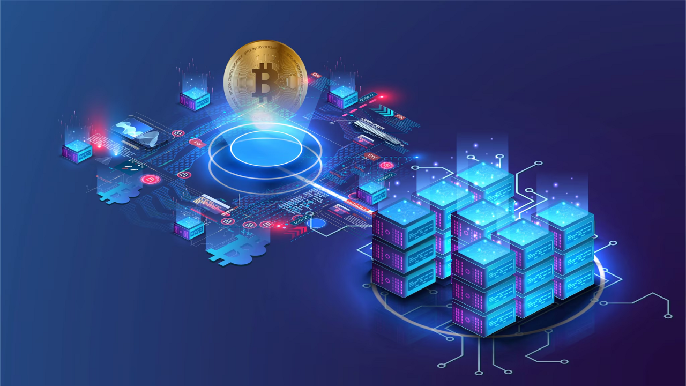

# Technical Infrastructure and Scalability

## Architecture Overview

BTCWU runs on a cloud-native, security-first foundation engineered for low latency, high throughput, and elastic growth. The platform blends multi-cloud resilience with edge acceleration so that traders experience consistent performance worldwide.

<figure><figcaption></figcaption></figure>

## Cloud Fabric

### Multi-Cloud & Edge
- Primary footprint on AWS with failover to Google Cloud; Azure footprint for regulatory residency.
- Regionally distributed clusters with proximity colocation in major financial centers.
- Hybrid connectivity to partner banks and custodians via dedicated links.
- Auto-scaling, global load balancing, and active-active disaster recovery.

### Infrastructure as Code
- Terraform + Crossplane for provisioning; GitOps pipelines via ArgoCD.
- Kubernetes (EKS/GKE) orchestrating containerized microservices.
- Service mesh (Istio) handling mTLS, traffic policy, and observability.
- Helm and Kustomize packaging; policy-as-code with OPA and Kyverno.

## Data Layer

### Storage Topology
- PostgreSQL (Citus) for transactional workloads with sharding and HA.
- Redis + Aerospike for ultra-low-latency caches and session state.
- InfluxDB/TimescaleDB for time-series market data.
- Elasticsearch/OpenSearch for search, anomaly detection, and SIEM.
- Snowflake and BigQuery powering analytics, BI, and regulatory reporting.
- IPFS/S3-compatible object stores for documents and ledger archives.

### Data Governance
- Encryption at rest/in transit, HSM-backed key management, and tokenization.
- Data lifecycle workflows (archival, retention, purging) automated via Airflow.
- Master data management, data catalog, and lineage tracking (Amundsen).
- Role-based and attribute-based access controls enforced at data plane.

## Microservices & Integration

### Service Design
- Domain-driven boundaries, hexagonal architecture, and clean contracts.
- API gateway (Kong) with rate limiting, JWT validation, and schema enforcement.
- Event backbone on Kafka/Pulsar with CDC and event sourcing patterns.
- CQRS, sagas, and idempotent commands for reliability and auditability.

### External Connectivity
- FIX, REST, WebSocket, and gRPC interfaces for clients and partners.
- Secure tunnels and hardware security modules for custody integrations.
- Real-time streaming via NATS/WebRTC for high-frequency clients.

## Scalability Toolkit

### Horizontal & Vertical Scaling
- Auto-scaling groups keyed to CPU, latency, and queue depth metrics.
- Workload-specific node pools (compute, GPU, memory, storage optimized).
- Database read replicas, partitioning, and hot/cold storage tiers.
- CDN + edge compute (Cloudflare Workers) for static content and light compute.

### Performance Engineering
- Profiling, flame graphs, and eBPF tracing for hotspots.
- Adaptive caching, pre-computed analytics, and query optimization.
- Queue buffering, circuit breakers, and graceful degradation playbooks.
- Synthetic load tests, chaos engineering, and fault injection.

## Security Stack

### Network & Platform Security
- Zero-trust networking, VPC segmentation, and private service endpoints.
- WAF, DDoS shields, bot mitigation, and TLS 1.3 enforced across services.
- Micro-segmentation with Calico/Cilium; hardware-backed network ACLs.

### Application & Data Security
- OAuth2/OIDC, SSO, device trust, and adaptive MFA.
- Secrets orchestration via HashiCorp Vault and AWS KMS.
- Secure SDLC with SAST, DAST, SCA, container scanning, and SBOMs.
- Continuous compliance monitoring (SOC, ISO, PCI, GDPR).

## Observability & Operations

### Monitoring & Telemetry
- Prometheus, Grafana, and Loki for metrics, dashboards, and logs.
- OpenTelemetry instrumentation with distributed tracing (Jaeger).
- Real user monitoring, synthetic pacing, and SLO-driven alerting.
- Business KPI dashboards tracking trades, liquidity, and risk indicators.

### Incident Response
- 24/7 NOC/SOC with on-call rotations and automated runbooks.
- PagerDuty, Slack, and ServiceNow integrated for rapid collaboration.
- Post-incident reviews, blameless culture, and remediation tracking.

## DevSecOps & Automation

### Delivery Pipeline
- CI/CD via GitHub Actions and Jenkins with policy gates.
- Blue/green, canary, and feature flag rollouts.
- Automated regression, performance, security, and compliance testing.
- Environment parity across dev/stage/prod with ephemeral preview environments.

### Automation & Optimization
- Autoscaling cost controls, commitment planning, and spot instance orchestration.
- FinOps dashboards and anomaly detection for spend governance.
- Self-healing mechanisms with health probes and auto-remediation scripts.

## Resilience & Continuity

### Disaster Recovery
- RPO < 5 minutes, RTO < 30 minutes via multi-region replication.
- Quarterly failover exercises and unannounced DR drills.
- Immutable backups, point-in-time recovery, and air-gapped archival.

### Business Continuity
- Scenario planning (market stress, infrastructure outage, cyber event).
- Crisis communication playbooks and stakeholder notification protocols.
- Vendor redundancy and exit plans for critical third parties.

BTCWU’s infrastructure is purpose-built for mission-critical trading—combining resiliency, speed, and governance to stay ahead of market demands while protecting client trust.
