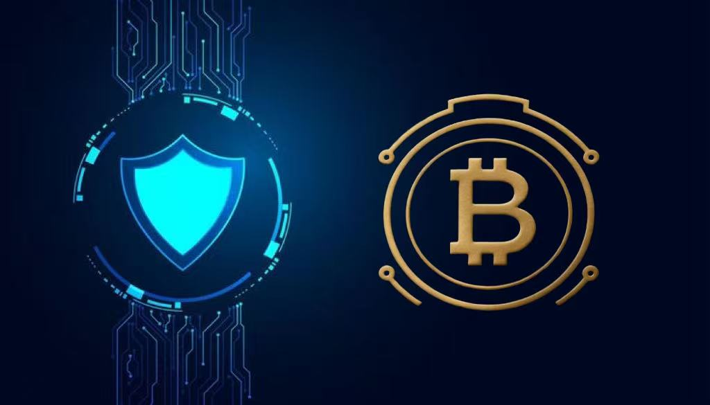

# Advanced Security Measures

## Security Vision

BTCWU operates with the assumption of breach—designing layered defenses that adapt faster than threats evolve. Our program synthesizes AI-driven detection, hardware roots of trust, and zero-trust access to protect people, data, and transactions end-to-end.

<figure><figcaption></figcaption></figure>

## Intelligent Defense

### AI & Analytics
- Behavioral baselines across users, devices, and services updated continuously.
- Machine learning models flag anomalies, privilege misuse, and coordinated attacks.
- Predictive scoring anticipates risk hotspots and triggers automated safeguards.
- Ensemble models reduce false positives while escalating true threats instantly.

### Autonomous Response
- SOAR platform executes playbooks for containment, isolation, and recovery.
- Dynamic access policies throttle or suspend suspicious sessions in seconds.
- Risk-aware throttling of withdrawals, API usage, and asset transfers.
- Continuous model validation, drift detection, and red-teaming.

## Identity & Access Hardening

### Advanced Authentication
- Passwordless flows powered by FIDO2 security keys, device biometrics, and WebAuthn.
- Behavioral biometrics (keystroke, mouse dynamics, device posture) augment access decisions.
- Adaptive MFA responds to context: geo anomalies, device trust score, transaction value.

### Hardware Trust Anchors
- HSM-backed cryptographic operations, secure enclaves (SGX/TEE) for sensitive compute.
- TPM attestation verifying endpoint integrity before granting access.
- Secure element integration on mobile with remote key destruction capability.

### Privacy-Preserving Identity
- Decentralized identifiers, selective disclosure credentials, and zero-knowledge proofs.
- Self-sovereign identity options for institutional clients and partners.

## Cryptographic Assurance

### Quantum-Ready Roadmap
- Hybrid key exchanges combining classical curves with NIST PQC finalists.
- Hash-based signatures for critical attestations and proof-of-reserves.
- Migration rehearsals ensuring agility when PQC standards finalize.

### Advanced Encryption
- Homomorphic and secure multi-party computation pilots for analytics on encrypted data.
- Differential privacy protections embedded in aggregated reporting.
- Threshold cryptography separates key shares across teams and geography.

## Network & Infrastructure Security

### Zero Trust Architecture
- Micro-segmentation with identity-aware proxies and mutual TLS.
- Continuous verification for every request; least privilege enforced dynamically.
- Encrypted east-west traffic, protocol isolation, and service-level ABAC.

### Threat Countermeasures
- Deception grids, honeypots, and fake credentials confusing attackers.
- Endpoint detection and response across workstations, servers, containers, and mobile.
- Threat intelligence fusion from commercial feeds, ISACs, dark web monitoring, and internal analytics.

## Data Safeguards

### Data Loss Prevention
- Content/Context-aware DLP with AI classification and real-time enforcement.
- Inline redaction, watermarking, and tamper detection.
- Immutable, air-gapped backups with cryptographic integrity checks.

### Privacy Enhancements
- Synthetic data generation for testing and model development.
- Privacy budget management for analytics via differential privacy.
- Secure aggregation allowing federated learning across partners.

## Monitoring & Governance

### Unified Observability
- Telemetry lake correlating logs, metrics, traces, and business events.
- Graph analytics mapping threat paths, privilege relationships, and supply chain exposure.
- Time-series forecasting for security capacity and anomaly spotting.

### Automation & Orchestration
- Playbook library covering credential theft, insider risk, DDoS, and API abuse.
- KPI/KRI dashboards for executives, regulators, and clients.
- Continuous control validation aligned to SOC 2, ISO 27001, PCI DSS, and GDPR.

## Third-Party & Supply Chain Defense

- Continuous vendor risk scoring, contract clauses enforcing security SLAs.
- Embedded agents for real-time posture monitoring where feasible.
- Joint incident simulations with critical partners and escrowed contingency plans.

## Innovation Pipeline

- Security R&D lab exploring confidential computing, MPC wallets, and AI explainability.
- Partnerships with universities, CERTs, and industry alliances.
- Bug bounty and VDP encouraging responsible disclosure.
- Quarterly emerging-tech reviews (5G, IoT, edge, serverless security).

BTCWU’s advanced security posture stays ahead of adversaries by combining proactive intelligence, hardened identity, and relentless innovation—ensuring user trust remains uncompromised.
