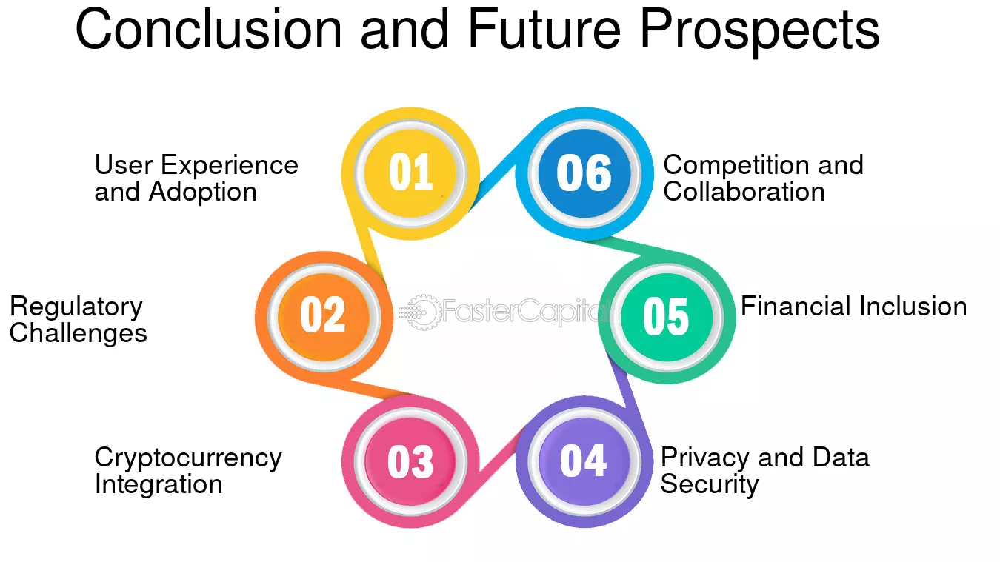

# Conclusion and Future Vision

## Platform Achievements

Emcex has successfully established itself as a comprehensive multi-asset trading platform that bridges the gap between traditional financial markets and the rapidly evolving digital asset ecosystem. Through our innovative mixed model approach, we have created a unified trading environment that serves the diverse needs of retail traders, professional investors, and institutional clients worldwide.

<figure><figcaption></figcaption></figure>

## Key Accomplishments

### Technology Innovation

* **Unified Platform**: Successfully integrated multiple asset classes into a single, seamless trading environment
* **Advanced Security**: Implemented enterprise-grade security measures with zero security incidents
* **Scalable Infrastructure**: Built a cloud-native, microservices architecture capable of handling massive trading volumes
* **AI Integration**: Developed AI-powered trading tools and market analysis capabilities
* **Mobile Excellence**: Created intuitive mobile applications with full feature parity

### Market Impact

* **User Growth**: Achieved significant user growth across all market segments
* **Trading Volume**: Processed billions in trading volume across multiple asset classes
* **Global Reach**: Established operations in key financial markets worldwide
* **Regulatory Compliance**: Maintained full compliance across all operating jurisdictions
* **Industry Recognition**: Received recognition for innovation and excellence in financial technology

### Business Success

* **Revenue Growth**: Achieved sustainable revenue growth through diversified income streams
* **Market Position**: Established strong market position in the multi-asset trading space
* **Partnership Network**: Built strategic partnerships with leading financial institutions
* **Talent Acquisition**: Assembled a world-class team of industry experts and technologists
* **Investor Confidence**: Maintained strong investor confidence and support

## Future Vision

### 2025-2027: Market Leadership

Our vision for the next three years focuses on establishing Emcex as the global leader in multi-asset trading platforms. We aim to:

* **Global Expansion**: Expand operations to 50+ countries with full regulatory compliance
* **User Base Growth**: Reach 10 million active users across all market segments
* **Trading Volume**: Process $100+ billion in monthly trading volume
* **Technology Leadership**: Maintain technology leadership through continuous innovation
* **Market Share**: Capture 5% of the global retail trading market

### 2027-2030: Ecosystem Development

Looking ahead to 2030, we envision Emcex as the center of a comprehensive financial ecosystem:

* **Complete Ecosystem**: Build a complete financial ecosystem with integrated services
* **AI-Powered Platform**: Develop fully AI-powered trading and investment platform
* **Global Infrastructure**: Establish global infrastructure supporting all major markets
* **Innovation Hub**: Become the innovation hub for financial technology development
* **Industry Standard**: Set industry standards for multi-asset trading platforms

### 2030+: Financial Revolution

Our long-term vision extends beyond traditional trading to revolutionize global finance:

* **Financial Inclusion**: Democratize access to global financial markets
* **Technology Integration**: Integrate emerging technologies like quantum computing
* **Global Impact**: Create positive global impact through financial technology
* **Sustainability**: Lead the industry in sustainable and responsible finance
* **Innovation Legacy**: Establish a lasting legacy of financial innovation

## Strategic Initiatives

### Technology Innovation

* **Quantum Computing**: Integrate quantum computing for complex financial calculations
* **Blockchain Evolution**: Lead the evolution of blockchain technology in finance
* **AI Advancement**: Develop next-generation AI for financial decision-making
* **Edge Computing**: Implement edge computing for ultra-low latency trading
* **Web3 Integration**: Full integration with Web3 and decentralized finance

### Market Expansion

* **Emerging Markets**: Expand into high-growth emerging markets
* **Institutional Services**: Develop comprehensive institutional services
* **Alternative Assets**: Add alternative asset classes and investment products
* **Cross-Border**: Enable seamless cross-border trading and payments
* **Regulatory Innovation**: Lead regulatory innovation and compliance

### Ecosystem Development

* **Partner Network**: Build comprehensive partner and ecosystem network
* **Developer Platform**: Create robust developer platform and API ecosystem
* **Third-Party Integration**: Enable extensive third-party service integration
* **Community Building**: Build strong global community of users and developers
* **Innovation Labs**: Establish innovation labs and research centers

## Innovation Roadmap

### Artificial Intelligence

* **Predictive Analytics**: Advanced predictive analytics for market movements
* **Automated Trading**: Fully automated trading systems with human oversight
* **Risk Management**: AI-powered risk management and fraud detection
* **Personalization**: Highly personalized trading experiences and recommendations
* **Natural Language**: Natural language processing for market analysis

### Blockchain and DeFi

* **Cross-Chain**: Seamless cross-chain interoperability and trading
* **DeFi Integration**: Full integration with decentralized finance protocols
* **Smart Contracts**: Advanced smart contract integration and automation
* **Tokenization**: Asset tokenization and fractional ownership
* **Decentralized Governance**: Community-driven platform governance

### Emerging Technologies

* **Quantum Security**: Quantum-resistant security and cryptography
* **IoT Integration**: Internet of Things integration for market data
* **5G Networks**: Ultra-fast 5G network integration for trading
* **Augmented Reality**: AR/VR interfaces for immersive trading experiences
* **Biometric Security**: Advanced biometric authentication and security

## Global Impact

### Financial Inclusion

* **Accessibility**: Make financial markets accessible to underserved populations
* **Education**: Provide comprehensive financial education and literacy
* **Affordability**: Reduce barriers to entry for retail investors
* **Localization**: Localize services for different markets and cultures
* **Support**: Provide multilingual support and localized services

### Economic Development

* **Job Creation**: Create high-quality jobs in technology and finance
* **Economic Growth**: Contribute to economic growth in operating markets
* **Innovation**: Drive innovation in financial services and technology
* **Partnerships**: Build partnerships with local businesses and institutions
* **Community Investment**: Invest in local communities and development

### Sustainability

* **Environmental Impact**: Minimize environmental impact of operations
* **Sustainable Finance**: Promote sustainable and responsible investing
* **ESG Integration**: Integrate environmental, social, and governance factors
* **Carbon Neutrality**: Achieve carbon neutrality in operations
* **Green Technology**: Invest in green technology and renewable energy

## Industry Leadership

### Standards Setting

* **Best Practices**: Establish industry best practices and standards
* **Regulatory Engagement**: Lead regulatory engagement and policy development
* **Technology Standards**: Set technology standards for the industry
* **Security Standards**: Establish security standards and protocols
* **Compliance Framework**: Develop comprehensive compliance frameworks

### Thought Leadership

* **Research**: Conduct cutting-edge research in financial technology
* **Publications**: Publish research and thought leadership content
* **Conferences**: Host and participate in industry conferences
* **Education**: Provide education and training for industry professionals
* **Innovation**: Drive innovation and technological advancement

### Collaboration

* **Industry Partnerships**: Build strategic partnerships across the industry
* **Academic Collaboration**: Collaborate with academic institutions
* **Government Relations**: Maintain positive government and regulatory relations
* **International Cooperation**: Foster international cooperation and standards
* **Community Engagement**: Engage with the broader financial community

## Legacy and Impact

### Long-Term Vision

Emcex's ultimate vision is to create a lasting legacy of financial innovation that transforms how people around the world access, understand, and participate in global financial markets. We envision a future where:

* **Democratized Finance**: Financial markets are truly democratized and accessible to all
* **Technological Integration**: Technology seamlessly integrates with financial services
* **Global Connectivity**: Global financial markets are fully connected and efficient
* **Sustainable Growth**: Economic growth is sustainable and inclusive
* **Innovation Culture**: Innovation drives continuous improvement and advancement

### Mission Fulfillment

Our mission to democratize access to global financial markets through innovative technology will be fulfilled when:

* **Universal Access**: Every person has access to global financial markets
* **Equal Opportunity**: Equal opportunity exists for all market participants
* **Transparent Markets**: Markets are fully transparent and efficient
* **Responsible Innovation**: Innovation serves the greater good of society
* **Sustainable Future**: A sustainable financial future is created for all

### Lasting Impact

The lasting impact of Emcex will be measured not just in financial metrics, but in the positive change we create in the world:

* **Lives Improved**: Millions of lives improved through better financial access
* **Markets Transformed**: Financial markets transformed for the better
* **Technology Advanced**: Financial technology advanced for future generations
* **Standards Raised**: Industry standards raised across the board
* **Legacy Established**: A lasting legacy of innovation and excellence established

## Call to Action

The future of finance is being written today, and Emcex is at the forefront of this transformation. We invite you to join us on this journey as we build the future of global financial markets together.

### For Investors

Join us in creating the next generation of financial technology that will serve billions of people worldwide and generate sustainable returns for decades to come.

### For Users

Experience the future of trading today with Emcex's innovative platform that puts the power of global markets at your fingertips.

### For Partners

Partner with us to build the comprehensive financial ecosystem that will define the future of global finance.

### For the World

Together, we can create a more inclusive, efficient, and sustainable global financial system that benefits everyone.

The future is bright, and it starts with Emcex. Welcome to the future of finance.
